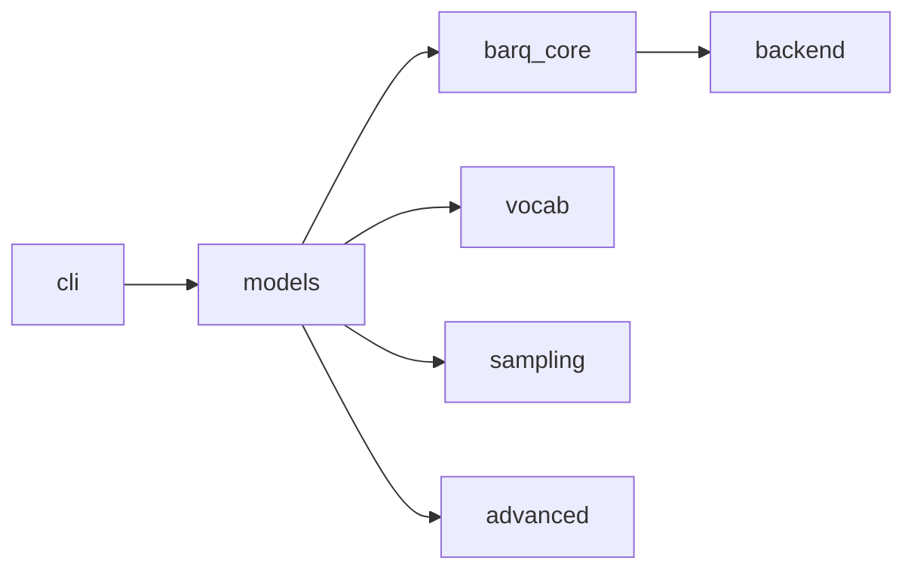

# Architecture Guide

## Overview

Barq Inference is split into focused crates so the inference pipeline can evolve without coupling everything to the CLI.

## Inference Flow

## Design Decisions

- `barq_core` owns tensors, GGUF parsing, math kernels, and low-level utilities.
- `models` owns architecture-specific wrappers, loader logic, and the multimodal scaffolding.
- `vocab` owns tokenization and chat templates so prompt formatting stays separate from model execution.
- `sampling` owns composable sampler chains and grammar-guided output.
- `advanced` keeps speculative decoding, FlashMLA, MoE helpers, and other research-oriented features out of the core path.
- `cli` coordinates the user-facing commands and the OpenAI-compatible server.

## Multimodal Foundation

The current multimodal layer is intentionally small:

- `models::vision` contains `ImageInput`, `ImagePreprocessor`, and a deterministic `ClipVisionEncoder`.
- `models::Qwen2VlModel` and `models::LlavaModel` wrap loaded GGUF models and expose image-token helpers.
- Architecture detection is handled by the loader and registry instead of hard-coded CLI branches.

## Why The Registry Exists

The architecture registry keeps the model-specific constructors in one place:

- GGUF metadata is mapped to a concrete `LlmArch`.
- The registry can answer whether an architecture is supported.
- New families can be added without reworking the CLI dispatch layer.

## Related Docs

- [Testing Guide](./TESTING.md)
- [Release Guide](./RELEASE.md)
- [User Guide](./USER_GUIDE.md)
